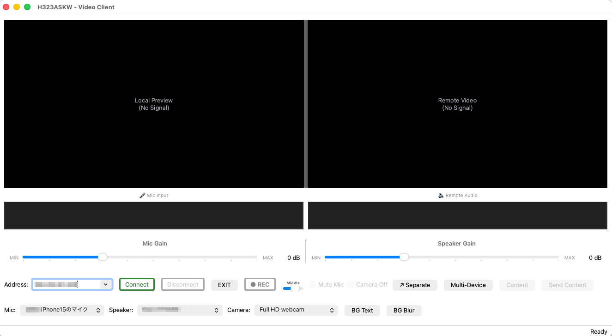

# H323ASKW

H323ASKW is an H.323 audio and video client for Apple Silicon Macs. It is
derived from [CallGen323](https://github.com/willamowius/callgen323) and uses
H323Plus, PTLib, Qt 6, and external media libraries.

The application supports direct H.323 calls, gatekeeper-based calls, local
audio and video device selection, and H.264, H.263, H.261, G.711, and G.722
media.

> **Source-only publication:** This project does not provide DMGs, application
> bundles, or other prebuilt binaries. Build from source for local use. The
> reviewed development environment uses a GPL-enabled FFmpeg build, whose
> binary redistribution requirements have not been resolved. See
> [Third-Party Notices](THIRD-PARTY-NOTICES.md).


## Screenshot
<p>
  
</p>

## Contents

1. [System Requirements](#system-requirements)
2. [Installation](#installation)
3. [First Launch](#first-launch)
4. [Basic Usage](#basic-usage)
5. [Command-Line Options](#command-line-options)
6. [Configuration](#configuration)
7. [Troubleshooting](#troubleshooting)
8. [Building from Source](#building-from-source)
9. [License and Third-Party Components](#license-and-third-party-components)

## System Requirements

### Supported Systems

- macOS 11.0 Big Sur or later
- Apple Silicon Mac (M1, M2, M3, M4, or later)

The supported local build target is ARM64 and does not run on Intel Macs.

### Runtime Dependencies

Install the build dependencies listed under [Building from Source](#building-from-source)
on your Mac. A locally assembled application bundle can contain its own
libraries, but this project does not distribute one.

### Hardware

| Item | Minimum | Recommended |
| --- | --- | --- |
| Memory | 4 GB | 8 GB or more |
| Storage | 200 MB | 500 MB |
| Camera | Built-in or external webcam | |
| Microphone | Built-in or external microphone | |
| Network | 1 Mbps | 10 Mbps or more |

### Codecs

| Media | Codecs |
| --- | --- |
| Video | H.264, H.263, H.261 |
| Audio | G.711 mu-law/A-law, G.722 |

## Installation

Build the application from source using [Building from Source](#building-from-source).
You can run the resulting executable locally. For optional local bundle
assembly, see the [bundle build guide](docs/APP_BUNDLE_BUILD_GUIDE.md); no
prebuilt bundle or DMG is provided.

## First Launch

### Gatekeeper Warning

An unsigned local build may be blocked because macOS cannot verify its developer.
Use one of the following methods:

1. Control-click `H323ASKW.app`, select **Open**, and confirm.
2. Open **System Settings > Privacy & Security** and select **Open Anyway**.
3. Remove the quarantine attribute from your own local build, if needed:

   ```bash
   xattr -cr /Applications/H323ASKW.app
   ```

Removing quarantine disables a macOS security check. Only do this for an
application bundle whose source and integrity you trust.

### Camera and Microphone Access

Allow camera and microphone access when macOS prompts for permission. These
permissions can be changed later under:

**System Settings > Privacy & Security > Camera / Microphone**

Restart H323ASKW after changing a permission.

## Basic Usage

### Launch from Terminal

```bash
/Applications/H323ASKW.app/Contents/MacOS/h323askw [options]
```

Alternatively:

```bash
cd /Applications/H323ASKW.app/Contents/MacOS
./h323askw [options]
```

### Make a Call

Call an H.323 address:

```bash
./h323askw -n 192.168.1.100
```

Call through a gatekeeper:

```bash
./h323askw -g gatekeeper.example.com -n endpoint_alias
```

### Wait for an Incoming Call

```bash
./h323askw -l
```

Listen on a specific port:

```bash
./h323askw -l -p 1720
```

### Launch from Finder

If you assembled a local bundle, open `/Applications/H323ASKW.app`. Its launcher
starts H323ASKW with the default configuration.

## Command-Line Options

The available options can vary with the build. Run `h323askw --help` for the
authoritative list.

### Connection Options

| Option | Description | Example |
| --- | --- | --- |
| `-n <address>` | Destination address | `-n 192.168.1.100` |
| `-g <gatekeeper>` | Gatekeeper address | `-g gk.example.com` |
| `-l` | Wait for incoming calls | `-l` |
| `-p <port>` | Listening port | `-p 1720` |

### Media Options

| Option | Description | Example |
| --- | --- | --- |
| `--video` | Enable video | `--video` |
| `--no-video` | Disable video | `--no-video` |
| `-s <device>` | Select an audio device | `-s "Default Audio Input"` |
| `-v <device>` | Select a video device | `-v "Default Video Input"` |

### Logging Options

| Option | Description | Example |
| --- | --- | --- |
| `-t <level>` | Set the trace level | `-t 3` |
| `-o <file>` | Write trace output to a file | `-o debug.log` |
| `--help` | Display help | `--help` |

Examples:

```bash
# Make a video call with trace level 3
./h323askw -n 192.168.1.100 --video -t 3

# Wait for a call and write a trace log
./h323askw -l -t 4 -o /tmp/h323askw.log

# Call an alias through a gatekeeper
./h323askw -g 10.0.0.1 -n user@example.com --video
```

## Configuration

### User Preferences

Address history is stored in:

```text
~/Library/Preferences/com.H323ASKW.VideoClient.plist
```

The application stores up to 20 recent addresses. To clear the history:

```bash
rm -f ~/Library/Preferences/com.H323ASKW.VideoClient.plist
```

### Plugin Layout

Packaged plugins are loaded from:

```text
H323ASKW.app/Contents/Resources/plugins/
├── audio/
├── sound/
├── video/
└── vidinput/
```

Typical plugins include:

```text
video/H.264/h264_video_pwplugin.dylib
video/H.263-ffmpeg/h263-ffmpeg_video_pwplugin.dylib
video/H.261-vic/h261-vic_video_pwplugin.dylib
vidinput/vidinput_macos_pwplugin.dylib
sound/portaudio_pwplugin.dylib
audio/g722_audio_pwplugin.dylib
```

### Environment Variables

| Variable | Purpose |
| --- | --- |
| `PTLIB_PLUGIN_DIR` | PTLib plugin directory |
| `PWLIB_PLUGIN_DIR` | Legacy PTLib plugin directory |
| `H323_PLUGIN_DIR` | H.323 plugin directory |
| `PTRACE_LEVEL` | Default trace level |

Example:

```bash
export PTRACE_LEVEL=4
./h323askw -l
```

## Uninstallation

Remove the application:

```bash
rm -rf /Applications/H323ASKW.app
```

Optionally remove its preferences:

```bash
rm -f ~/Library/Preferences/com.H323ASKW.VideoClient.plist
```

## Troubleshooting

### Application Does Not Start

If `dyld` reports that a bundled library such as `libh323.dylib` cannot be
loaded, the application bundle may be incomplete or damaged. Recreate or
reinstall the bundle.

If macOS reports that the application is damaged, verify the source of the
bundle before removing quarantine:

```bash
xattr -cr /Applications/H323ASKW.app
```

### Camera or Microphone Is Unavailable

1. Check the Camera and Microphone permissions in System Settings.
2. Restart H323ASKW after changing permissions.
3. Launch from Terminal and capture a trace:

   ```bash
   ./h323askw -l -t 4 2>&1 | tee debug.log
   ```

### A Call Cannot Be Established

H.323 commonly uses:

| Port | Protocol | Purpose |
| --- | --- | --- |
| 1720 | TCP | H.225 call signaling |
| 1719 | UDP | Gatekeeper RAS |
| Dynamic ports | UDP | RTP audio and video |

Allow H323ASKW through the macOS firewall. NAT environments may also require
port forwarding or H.460 support, depending on the network and remote
endpoint.

### No Video Is Displayed

1. Confirm that the remote endpoint supports H.264, H.263, or H.261.
2. Capture a detailed trace:

   ```bash
   ./h323askw -n 192.168.1.100 --video -t 5 -o video_debug.log
   ```

3. Confirm that the expected codec plugins were loaded from the application
   bundle.

### Video Stops After the First Frame

An affected H323Plus build can report:

```text
Buffer too small (2000 bytes), required: 1382400 bytes
Failed to read data from video grabber
```

See [Required H323Plus Video Patch](#required-h323plus-video-patch).

### No Audio Is Sent or Received

Check the selected input/output devices, system volume, and microphone mute
state. To inspect available devices when supported by the build:

```bash
./h323askw --list-audio-devices
```

For G.722 calls that connect but transmit no usable audio, see
[G.722 Packetization Fix](#g722-packetization-fix).

### Collect a Trace Log

```bash
./h323askw [normal options] -t 6 \
  -o ~/Desktop/h323askw_debug.log 2>&1
```

System-level messages can also be found by searching for `h323askw` in
`Console.app`.

## Building from Source

The supported build target is an Apple Silicon Mac with Xcode Command Line
Tools and Homebrew. The standalone source checkout needs two public sibling
repositories; neither is vendored here. Install the build packages first:

```bash
brew install automake bison flex openssl@3 pkg-config qt speexdsp ffmpeg x264
```

Then, from a common parent directory:

```bash
git clone https://github.com/willamowius/ptlib.git
git clone https://github.com/willamowius/h323plus.git
git clone https://github.com/y-asakawa/h323askw.git
cd ptlib && git checkout f85a10209ac25fdd8bbb8e835c5da161d682e5ac
./configure --enable-ipv6 --disable-odbc --disable-sdl --disable-lua --disable-expat
make debugnoshared
cd ../h323plus && git checkout ea2072978f0334583b550dbfc8b5f6eb7303cbef
PWLIBDIR="$(cd ../ptlib && pwd)" ./configure --enable-h235 --enable-h235-256 --enable-h46017 --enable-h46026 --enable-h46019m --enable-h249 --enable-h46025 --enable-h460p --enable-h460pre --enable-h460com --enable-h460im --enable-h461 --enable-t120 --enable-t140 --enable-aec
PWLIBDIR="$(cd ../ptlib && pwd)" make debugnoshared
cd ../h323askw
PKG_CONFIG_PATH="$(brew --prefix qt)/lib/pkgconfig:$(brew --prefix openssl@3)/lib/pkgconfig" make video
```

The [build workflow](.github/workflows/build.yml) runs the same application
build on a clean macOS runner for each push and pull request.
`PWLIBDIR`, `OPENH323DIR`, and `MOC` may be set to use different locations.
The commands above build the static CI target. For a local build that uses the
macOS camera plugin, also build shared PTLib and H323Plus, then build H323ASKW:

```bash
cd ../ptlib && make optshared
cd ../h323plus && make optshared
cd ../h323askw && make
```

`make` (or `make default`) builds `obj_Darwin_aarch64/h323askw` against the
shared PTLib and H323Plus libraries. This is the build to use with dynamic
camera plugins. For example, after building the PTLib macOS camera plugin,
check its registration with:

```bash
./obj_Darwin_aarch64/h323askw --list-cameras
```

`make video` remains a static debug build for CI and writes
`obj_Darwin_aarch64_d_s/h323askw`; its separate PTLib registry cannot use the
shared macOS camera plugin. Both targets build the application only: neither
produces a DMG or an H.264 codec plugin. The camera plugin must be built
separately and is not included in the public upstream PTLib checkout.

For optional codec plugins and application bundle packaging, see
[the build guide](docs/APP_BUNDLE_BUILD_GUIDE.md). A public H323Plus checkout
contains the plugin sources used by the bundle script, but plugin build and
runtime compatibility are not covered by the application-build workflow.
The separately maintained `y-asakawa/h323plus-plugins` repository is not yet
public and is not required to build the application source. The macOS camera and
PortAudio PTLib plugins required by the bundle script are not present in the
public upstream PTLib checkout, so a full-featured bundle cannot yet be
reproduced from public sources alone. The maintainer does not publish binaries;
anyone considering redistribution must independently review the completed
build and applicable licenses in the
[dependency license review](docs/DEPENDENCY-LICENSE-REVIEW.md).

### Required H323Plus Video Patch

Some H323Plus versions overwrite the raw video frame size with the RTP output
buffer size in `h323plus/src/h323pluginmgr.cxx`. This causes video capture to
fail after the first frame.

In the affected locations, retain the buffer resize but remove or disable the
assignment to `bytesPerFrame`:

```cpp
dst.SetMinSize(outputDataSize);
// bytesPerFrame = outputDataSize;
```

```cpp
bufferRTP.SetMinSize(outputDataSize);
// bytesPerFrame = outputDataSize;
```

Rebuild H323Plus after applying the change:

```bash
cd h323plus
make clean
make
```

Symptoms of an unpatched build include:

- `Buffer too small (2000 bytes), required: 1382400 bytes`
- remote video freezing or not appearing
- every H.264 output frame being encoded as an I-frame
- severely reduced camera frame rate

### G.722 Packetization Fix

Some remote endpoints cannot use G.722 audio when the sender transmits one
1 ms frame per RTP packet. In affected H323Plus builds,
`H323_RTPChannel::Transmit()` in `h323plus/src/channels.cxx` should use 20
frames per packet for G.722:

```cpp
unsigned framesInPacket = capability->GetTxFramesInPacket();
rtpPayloadType = GetRTPPayloadType();

if (isAudio && rtpPayloadType == RTP_DataFrame::G722) {
  framesInPacket = 20;
} else if (framesInPacket > 8) {
  framesInPacket = 1;
}
```

Rebuild H323Plus and H323ASKW:

```bash
cd h323plus
make clean
make

cd ../h323askw
make clean
make
```

The trace should then contain a line similar to:

```text
Transmit G.722-64k thread started: ... size=20*8=160
```

If it still reports `size=1*8=8`, the application is probably linked to an
unpatched H323Plus library.

## License and Third-Party Components

H323ASKW is derived from the
[CallGen323](https://github.com/willamowius/callgen323) project. CallGen323 was
originally developed by Benny L. Prijono and was later maintained and extended
by Jan Willamowius and other contributors.

Files derived from CallGen323 are distributed under the Mozilla Public License
Version 1.0. See:

- [LICENSE.md](LICENSE.md)
- [NOTICE.md](NOTICE.md)
- [CHANGES.md](CHANGES.md)

H323ASKW uses or can be built with third-party libraries and codec plugins,
including H323Plus, PTLib, Qt, FFmpeg, x264, x265, OpenSSL, PortAudio, and
SpeexDSP. These components remain subject to their respective licenses and are
not relicensed under the H323ASKW license.

Additional information:

- [THIRD-PARTY-NOTICES.md](THIRD-PARTY-NOTICES.md): public attribution and
  third-party license index
- [docs/DEPENDENCY-LICENSE-REVIEW.md](docs/DEPENDENCY-LICENSE-REVIEW.md):
  build-dependent dependency and optional binary redistribution review record

The maintainer publishes source code only. This publication policy does not
restrict the rights granted by the applicable licenses. Anyone distributing a
binary built from this source must separately resolve the requirements for the
exact libraries, plugins, build options, and linking methods used.

H323ASKW is an independent project and is not endorsed by or affiliated with
the original CallGen323 developers or any third-party project.

## Additional Documentation

- [Japanese installation guide](docs/INSTALL_GUIDE.md)
- [macOS application bundle build guide](docs/APP_BUNDLE_BUILD_GUIDE.md)
- [Security policy](SECURITY.md)
